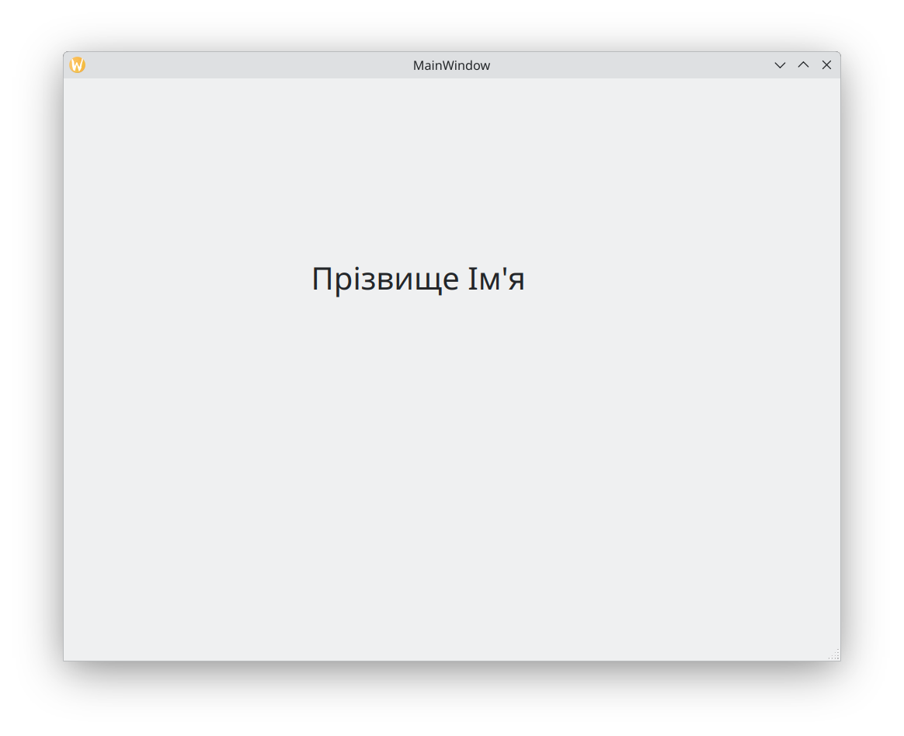

# Налаштування середовища Qt Creator і створення першого Qt Widgets-проєкту.

## Мета:
Ознайомитися з основами роботи в середовищі Qt Creator, налаштувати проект та створити простий Qt Widgets-додаток.

## Хід роботи:

### 1. Налаштування Qt Creator
1.1. Створення особистого профілю на сайті Qt:
   - Перейдіть на [офіційний сайт Qt, реєстрація](https://login.qt.io/register).
   - Зареєструйтеся, заповнивши необхідні поля (ім'я, прізвище, email, пароль).

1.2. Завантаження та встановлення Qt Creator:
   - Перейдіть на [сторінку завантаження Qt](https://www.qt.io/download-qt-installer-oss).
   - Завантажте Qt Online Installer для вашої операційної системи.
   - Запустіть інсталятор
   - Виконуйте інструкції в процесі встановлення, введіть ваш логін та пароль, створені на попередньому кроці.

### 2. Створення нового Qt Widgets-проєкту
2.1. Запуск Qt Creator:
   - Відкрийте Qt Creator після встановлення.
   - У вікні "Welcome" натисніть на "Create Project".
   - Виберіть тип проекту "Qt Widgets Application" і натисніть "Choose".

   - Введіть назву проєкту, наприклад, "MyFirstQtApp", і виберіть місце для збереження.

   - Виберіть систему збірки CMake for Qt 6.5 and later.

   - Назви класів та файлів можуть бути змінені на ваш розсуд, але рекомендується використовувати англійські назви.

   - Інформацію про переклади можна пропустити, натиснувши "Next".

   - Виберіть необхідний набір інструментів.

   - На кроці "Summary" можна вибрати систему версійного контролю, наприклад, Git, або пропустити цей крок.

2.2. Запуск проєкту:
   - Після створення проєкту натисніть кнопку "Run" або натисніть `Ctrl+R` для запуску програми.
   - Результатом повинно бути пусте вікно Qt Widgets-додатку.

## Додаткові ресурси:
- Відео інструкції з налаштування Qt Creator: [https://youtu.be/hy6Jft7WpGw](https://youtu.be/hy6Jft7WpGw)