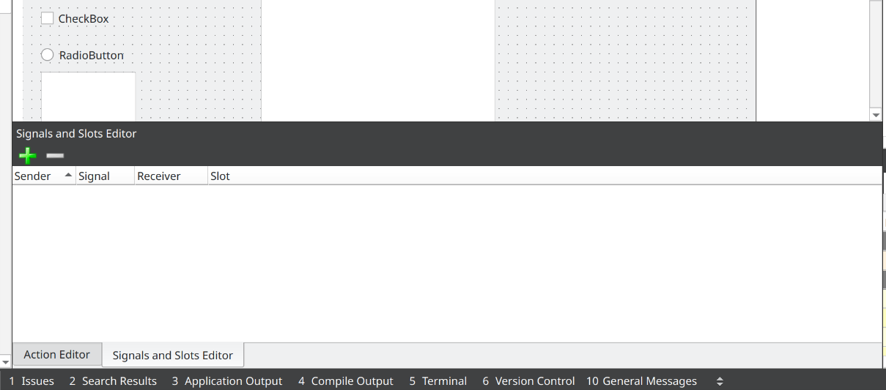
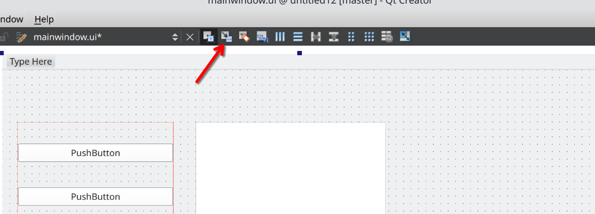
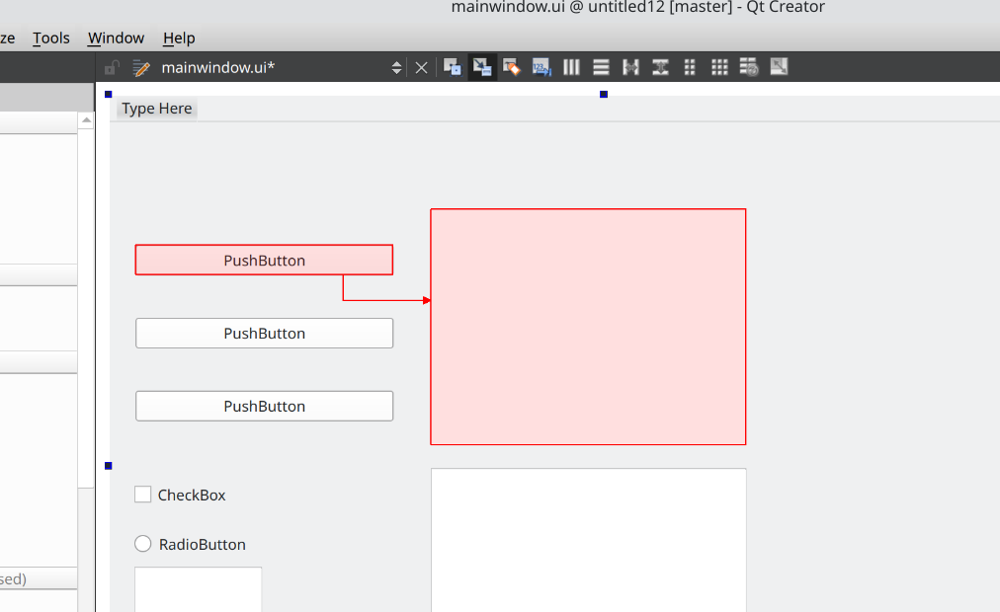
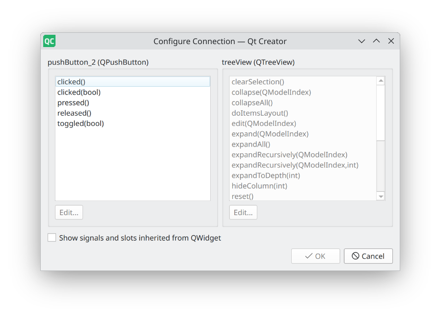

# Архітектура Qt: Signal/Slot, об’єктна модель, основні модулі.

## Архітектура Qt

Qt — це кросплатформний фреймворк, що забезпечує єдине API для розробки настільних, мобільних і вбудованих застосунків. Він будується за шаровим принципом: у його основі ― ядро з неконкурентних класів, поверх якого розташовані графічні, мережеві, мультимедійні та інші підсистеми. Це дозволяє розробникам писати код, який працюватиме на різних платформах без змін, використовуючи єдину архітектуру та API.

Код нижче демонструє, як за допомогою QStandardPaths та QMessageBox отримати шлях до папки «Документи» й показати його користувачеві.Той самий код компілюється й працює однаково на Windows, macOS та Linux, а фреймворк самостійно підставляє правильний шлях до системної директорії:
```cpp
#include <QApplication>
#include <QMessageBox>
#include <QStandardPaths>

int main(int argc, char *argv[])
{
    QApplication app(argc, argv);

    // Уніфікований доступ до папки «Документи»
    QString documentsDir = QStandardPaths::writableLocation(QStandardPaths::DocumentsLocation);

    QMessageBox::information(nullptr,
                             "Кросплатформний приклад",
                             "Ваші документи тут:
" + documentsDir);

    return 0;
}
```

'QStandardPaths' абстрагує файлову систему, а 'QMessageBox' створює нативне діалогове вікно з виглядом, властивим кожній ОС. Таким чином розробник пише один код, який працює на всіх підтримуваних платформах без '#ifdef'‑умов або специфічних бібліотек.

## Об’єктна модель та мета-об’єктна система

Усі класи, що використовують «сигнали/слоти», успадковуються від `QObject`.Ключова особливість `QObject` — інтеграція з **meta-object-системою** (MOC). Вона дає:
- динамічну інформацію про клас (`metaObject()`);
- механізм властивостей (`Q_PROPERTY`);
- автоматичне управління пам’яттю через ієрархію батько → дитина;
- рефлексію, завдяки якій можна інвокувати методи за іменем.

Наявність макроса `Q_OBJECT` у класі сигналізує MOC-у згенерувати додатковий код, потрібний для реєстрації сигналів, слотів і властивостей.

```cpp
#include <QObject>

class Worker : public QObject {
    Q_OBJECT
    Q_PROPERTY(bool busy READ isBusy NOTIFY busyChanged)
public:
    bool isBusy() const { return m_busy; }
signals:
    void busyChanged(bool);
private:
    bool m_busy = false;
};
```

## Signal/Slot

У графічному інтерфейсі програмування, коли ми змінюємо один віджет, ми часто хочемо, щоб інший віджет був повідомлений. Загалом, ми хочемо, щоб об'єкти будь-якого типу могли взаємодіяти один з одним. Наприклад, якщо користувач натискає кнопку Close, нам, ймовірно, потрібно, щоб функція close() була викликана.
У Qt це досягається не колбек-функціями, а спеціальним, компонентно-орієнтованим механізмом «сигнал-слот». Сигнал (event source) випромінюється під час події, а слот (event handler) виконується у відповідь; який саме слот спрацює, об’єкт-відправник не знає – завдяки цьому компоненти залишаються слабо пов’язаними й взаємозамінними.

Під час розробки у вас є декілька основних варіантів використання сигналів і слотів:
1. У режимі дизайну відкрити панель "Signal/Slot Editor" (можна знайти в меню "View" → "Toolbars" → "Signals and Slots Editor").
    
    - Натиснути `+` для створення нового з'єднання.
2. У режимі дизайну переключитись на режим "Edit Signals/Slots" (можна знайти в меню "View" → "Toolbars" → "Edit Signals/Slots").

    - Перетягнути ліву кнопку миші з одного віджета на інший, щоб створити з'єднання.

    - Вибрати сигнал з першого віджета та слот з другого віджета.

1. Програмно, використовуючи метод `connect()`:
```cpp
#include <QPushButton>
#include <QMessageBox>

QPushButton *button = new QPushButton("Click me");
QObject::connect(button, &QPushButton::clicked, []() {
    QMessageBox::information(nullptr, "Signal/Slot", "Button clicked!");
});
```

Також Qt підтримує різні типи з'єднань: Qt::DirectConnection, Qt::QueuedConnection, Qt::BlockingQueuedConnection, Qt::UniqueConnection, Qt::SingleShotConnection, які визначають, як саме буде виконуватись виклик слоту. Наприклад, `Qt::DirectConnection` викликає слот негайно в потоці відправника, тоді як `Qt::QueuedConnection` ставить виклик в чергу для виконання в потоці отримувача.


## Додаткові матеріали
- Introduction to Qt – офіційна документація: https://doc.qt.io/qt-6/qt-intro.html
- Signals & Slots – офіційна документація: https://doc.qt.io/qt-6/signalsandslots.html
- QObject Class Reference: https://doc.qt.io/qt-6/qobject.html
- Список модулів Qt 6: https://doc.qt.io/qt-6/qtmodules.html
- How to Create Qt Plugins: https://doc.qt.io/qt-6/plugins-howto.html
- Qt Wiki: Plugins: https://wiki.qt.io/Plugins