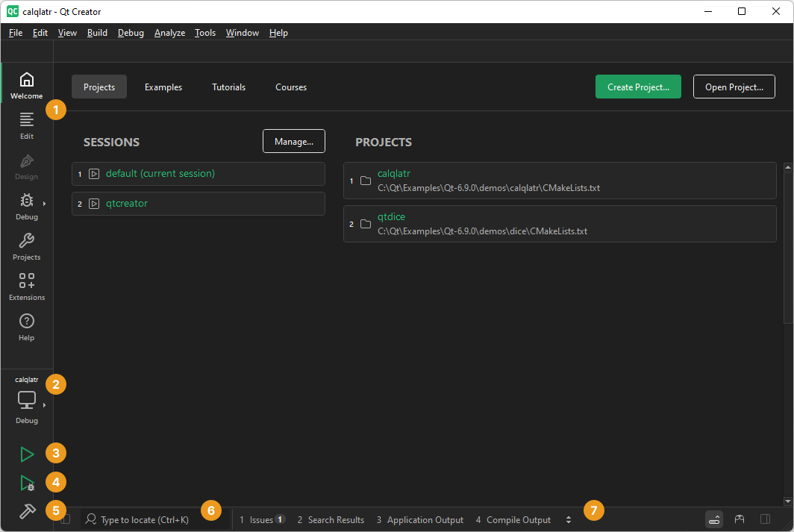
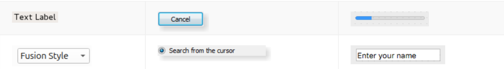
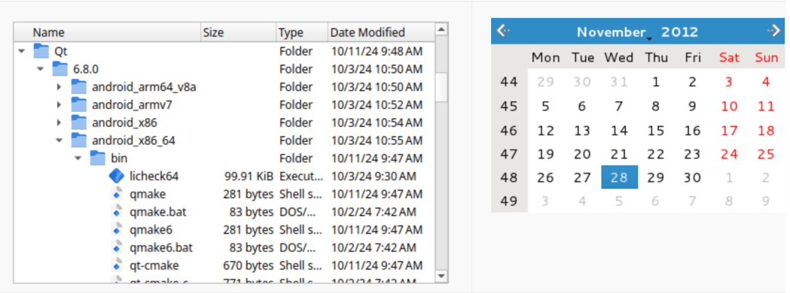
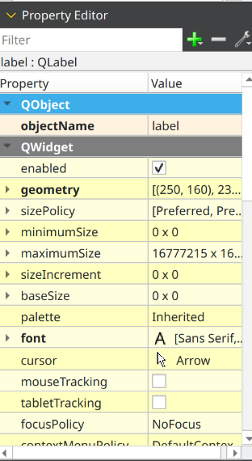
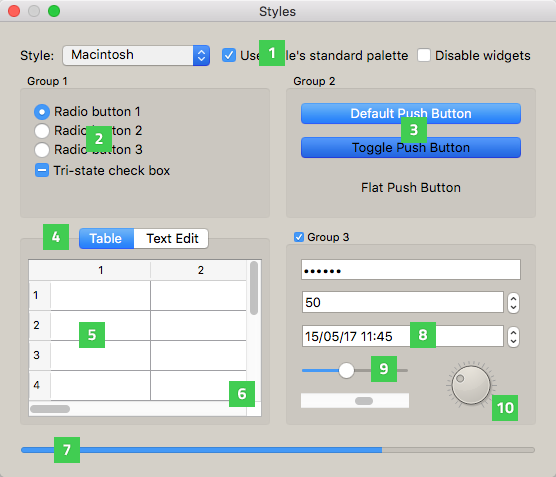
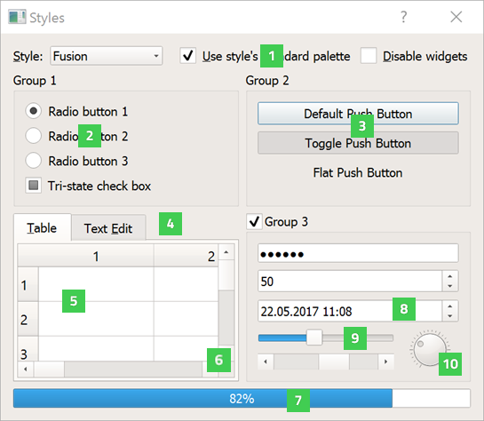

# Компоненти інтерфейсу. Стандартні віджети та їх властивості

## Інтерфейс Qt Creator
Відкривши Qt Creator, ви побачите головне вікно, яке складається з кількох основних частин:


| Номер | Елемент інтерфейсу | Призначення |
|-------|-------------------|-------------|
| 1 | Перемикач режимів | Виконання певних задач, таких як проєктування інтерфейсу, написання коду чи відлагодження програми |
| 2 | Вибір набору інструментів | Вибір відповідного набору для збірки проєкту та запуску на конкретному обладнанні |
| 3 | Кнопка запуску | Запуск програми на обраній цільовій платформі |
| 4 | Кнопка відлагодження | Відлагодження програми на обраній цільовій платформі |
| 5 | Кнопка збірки | Збірка програми з використанням обраного набору інструментів |
| 6 | Локатор | Пошук конкретного проєкту, файлу, класу чи функції |
| 7 | Вивід | Перегляд результатів збірки, запуску та інших дій |

## Режими роботи
Qt Creator має кілька режимів, які дозволяють виконувати різні завдання. 
Перемикання між режимами здійснюється за допомогою перемикача режимів (1) на панелі інструментів або за допомогою швидких клавіш:
- **Welcome** (Ctrl + 1): Режим для створення нових проєктів та відкриття існуючих.
- **Edit** (Ctrl + 2): Режим для написання та редагування коду.
- **Design** (Ctrl + 3): Режим для проєктування інтерфейсу користувача (UI).
- **Debug** (Ctrl + 4): Режим для відлагодження програм.
- **Projects** (Ctrl + 5): Режим для управління проєктами та їх налаштуваннями.
- **Extensions** (Ctrl + 6): Режим для роботи з розширеннями та плагінами.
- **Help** (Ctrl + 7): Режим для доступу до документації та довідкових матеріалів.

# Віджети Qt
Віджети Qt - це основні елементи інтерфейсу користувача, які використовуються для створення графічних інтерфейсів. Вони можуть бути використані для відображення тексту, зображень, кнопок, полів введення та інших елементів. Віджети Qt мають різні властивості, які можна налаштовувати.
Віджети Qt можна розділити на кілька категорій:
- **Базові**: Ці основні віджети (елементи керування), наприклад, кнопки, випадаючі списки та смуги прокручування, призначені для безпосереднього використання.


- **Розширені**: віджети вкладок та індикатори виконання, забезпечують складніші елементи керування інтерфейсом користувача.


- **Абстрактні**: не призначені для безпосереднього використання, але надають базову функціональність для створення власних віджетів.

- **Організаційні**: використовуються для організації та групування примітивів графічного інтерфейсу в складніші програми та діалогові вікна.

Повний список віджетів Qt можна знайти в [документації Qt](https://doc.qt.io/qt-6/widget-classes.html).

Оскільки віджети успадковані від певних базових класів, вони мають властивості притаманні цим класам. Наприклад, віджет QLabel успадковується від класу QWidget, тому він має всі властивості та методи, які надає цей базовий клас. Такими властивостями можуть бути:
- font: шрифт, який використовується для відображення тексту.
- cursor: вказівник миші, який відображається над віджетом.
- locale: локалізація, яка використовується для відображення тексту.
- baseSize: базовий розмір віджета, який використовується для визначення його розміру.
- enabled: властивість, яка визначає, чи віджет активний (може бути взаємодія з користувачем).

Всі ці властивості можна налаштовувати за допомогою Qt Creator, використовуючи панель властивостей (Properties) або програмно, використовуючи методи класу віджета.



Цей інтерфейс є особливо зручним, тому що групує властивості за базовими класами, а також за категоріями, такими як "Common", "Appearance", "Size Policy" та інші. Це дозволяє швидко знаходити потрібні властивості та налаштовувати їх.

У випадку, якщо ви хочете змінити властивості віджета програмно, ви можете зробити це за допомогою коду C++. Наприклад, щоб змінити текст QLabel, ви можете використовувати метод `setText()`:

```cpp
ui->label->setText("Новий текст");
```

## Стилі віджетів
Qt надає можливість змінювати зовнішній вигляд віджетів за допомогою стилів. Стилі дозволяють змінювати кольори, шрифти, розміри та інші властивості віджетів без необхідності змінювати код програми.
Ви можете використовувати стилі, які надаються Qt, або створювати власні стилі за допомогою CSS-подібного синтаксису.

Для того, щоб застосувати існуючий стиль до вашого проєкту необхідно в головному файлі проєкту (наприклад, `main.cpp`) додати наступний код:

```cpp
#include <QApplication>
#include <QStyleFactory>

int main(int argc, char *argv[])
{
    QApplication a(argc, argv);

    // Застосування стилю
    a.setStyle(QStyleFactory::create("Fusion"));

    return a.exec();
}
```

Цей код встановлює стиль "Fusion" для вашого додатку. Ви можете замінити "Fusion" на будь-який інший стиль, який підтримується Qt, наприклад, "Windows", "Macintosh", "Motif" тощо.

Приклад використання стилів у Qt Creator:
> macOS стиль

> Fusion стиль



## Додаткові матеріали
- Документація по інтерфейсу Qt creator на [офіційному сайті](https://doc.qt.io/qtcreator/creator-quick-tour.html).
- Вступ до Qt Creator на [офіційному сайті](https://www.qt.io/academy/course-catalog?level=basic#getting-started-with-qt-creator).
- Вступ до Qt widgets на [офіційному сайті](https://www.qt.io/academy/course-catalog?level=basic#introduction-to-qt-widgets:-part-7).