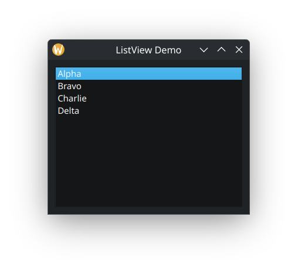

# Model–View Framework: QListView, QTableView, QTreeView

У розробці сучасних графічних інтерфейсів ефективне відображення та управління великими обсягами даних є одним з найскладніших завдань. Традиційний підхід, коли віджети безпосередньо зберігають і відображають дані, швидко стає некерованим і неефективним для складних додатків, що потребують гнучкості та масштабованості. Для вирішення цієї проблеми Qt пропонує потужний та гнучкий **Model–View Framework (Модель-Представлення)**.  
Цей фреймворк забезпечує чітке розділення відповідальності між даними (моделлю), їхнім відображенням (представленням/видом) та взаємодією з користувачем (делегатом). Таке розділення дозволяє створювати високоефективні, масштабовані та гнучкі інтерфейси, які можуть відображати одні й ті ж дані різними способами, а також легко адаптуватися до змін у даних без значних модифікацій UI. Це значно спрощує розробку, тестування та підтримку програм.  
У цій лекції ми детально розглянемо архітектуру Model–View Framework у Qt, її зв'язок з патерном MVC, та зосередимося на трьох основних класах представлень: `QListView`, `QTableView` та `QTreeView`.

## Архітектура Model–View Framework та патерн MVC

Qt Model–View Framework є реалізацією патерну проектування **Model-View-Controller (MVC)**, але з певними модифікаціями, які роблять його більш пристосованим до специфіки графічних інтерфейсів. У Qt цей патерн часто називають **Model-View-Delegate (MVD)**, де роль контролера розподілена між представленням (View) та делегатом (Delegate).  
Давайте розглянемо класичний патерн MVC, а потім побачимо, як Qt адаптує його.

### Класичний патерн Model-View-Controller (MVC)

MVC розділяє додаток на три взаємопов'язані компоненти:

1. **Модель (Model)**:  
   - **Роль**: Представляє дані та бізнес-логіку. Модель є незалежною від інтерфейсу користувача. Вона відповідає за зберігання, управління та маніпулювання даними.  
   - **Комунікація**: Модель повідомляє своїм "спостерігачам" (Views та Controllers) про будь-які зміни у своєму стані (даних), зазвичай через механізм сповіщень.  
2. **Представлення (View)**:  
   - **Роль**: Відповідає за відображення даних, отриманих від моделі. Представлення є візуальним компонентом. Воно не містить бізнес-логіки і не маніпулює даними безпосередньо.  
   - **Комунікація**: Представлення отримує дані від моделі та відображає їх. Воно також надсилає користувацькі дії (наприклад, кліки, введення тексту) контролеру.  
3. **Контролер (Controller)**:  
   - **Роль**: Діє як посередник між моделлю та представленням. Контролер отримує вхідні дані від користувача (через представлення), обробляє їх, оновлює модель відповідно до цих даних, а потім оновлює представлення, щоб відобразити зміни.  
   - **Комунікація**: Контролер отримує події від представлення, взаємодіє з моделлю (змінює дані) та інструктує представлення оновитися.

### Адаптація Qt: Model-View-Delegate (MVD)

У Qt Model–View Framework, роль контролера дещо змінена та розподілена:

1. **Модель (Model)**:  
   - **Роль**: Модель є інтерфейсом до даних. Вона **не зберігає самі дані**, а надає уніфікований доступ до них. Модель відповідає за:  
     - Надання даних представленням та делегатам за запитом.  
     - **Зберігання даних** (або доступ до них з іншого джерела, наприклад, бази даних, файлової системи, мережі, XML-файлу).  
     - **Маніпулювання даними** (додавання, видалення, зміна елементів).  
     - **Повідомлення представлень та делегатів про будь-які зміни в даних за допомогою сигналів**. Це дозволяє представленням автоматично оновлюватися, коли дані змінюються.  
   - **Базові класи**: Усі моделі в Qt успадковуються від QAbstractItemModel. Цей клас надає уніфікований інтерфейс для доступу до даних, незалежно від їхньої внутрішньої структури (список, таблиця, дерево).  
   - **Типи моделей**:  
     - QAbstractListModel: Для спискових даних (один стовпець). Потрібно реалізувати rowCount(), data().  
     - QAbstractTableModel: Для табличних даних (рядки та стовпці). Потрібно реалізувати rowCount(), columnCount(), data().  
     - QAbstractItemModel: Для ієрархічних даних (деревоподібних). Потрібно реалізувати rowCount(), columnCount(), data(), index(), parent(), hasChildren(). Це найскладніший клас для реалізації.  
   - **Готові моделі**: Qt також надає кілька готових моделей для типових випадків, що значно прискорює розробку:  
     - QStringListModel: Для простого списку рядків.  
     - QStandardItemModel: Універсальна та гнучка модель для списків, таблиць та дерев, що зберігає дані у вигляді QStandardItem об'єктів. Це часто використовувана модель для невеликих та середніх наборів даних.  
     - QFileSystemModel: Для відображення файлової системи.  
     - QSqlQueryModel, QSqlTableModel, QSqlRelationalTableModel: Для роботи з базами даних SQL.  
2. **Представлення (View)**:  
   - **Роль**: Представлення відповідає виключно за **відображення даних**, отриманих від моделі. Воно не зберігає дані само по собі, а лише запитує їх у моделі (через метод data()) та відображає. Представлення також відповідає за:  
     - **Обробку взаємодії користувача**, що не пов'язана з редагуванням (наприклад, виділення елементів, прокрутка, зміна розміру стовпців).  
     - **Передачу запитів на редагування делегату**.  
     - **Оновлення свого відображення** у відповідь на сигнали від моделі про зміни даних.  
   - **Базовий клас**: Усі представлення успадковуються від QAbstractItemView.  
   - **Типи представлень**:  
     - QListView: Відображає елементи у вигляді простого списку (один стовпець, вертикально або горизонтально).  
     - QTableView: Відображає елементи у вигляді таблиці (рядки та стовпці).  
     - QTreeView: Відображає елементи у вигляді ієрархічного дерева.  
   - **Зв'язок з моделлю**: Представлення підключається до моделі за допомогою методу setModel(QAbstractItemModel \*model).  
3. **Делегат (Delegate)**:  
   - **Роль**: Делегат відповідає за те, **як окремі елементи даних відображаються (малюються)** та **редагуються** у представленні. Це компонент, який бере на себе частину ролі контролера, пов'язану з редагуванням елементів.  
   - Кожен елемент у представленні малюється делегатом (метод paint()).  
   - Коли користувач починає редагувати елемент (наприклад, подвійним кліком), делегат створює відповідний редактор (наприклад, QLineEdit для текстового поля, QSpinBox для чисел) (метод createEditor()).  
   - Делегат також відповідає за передачу даних від редактора назад до моделі (метод setModelData()) та за оновлення геометрії редактора (метод updateEditorGeometry()).  
   - **Базовий клас**: Усі делегати успадковуються від QAbstractItemDelegate.  
   - **Стандартний делегат**: За замовчуванням використовується QStyledItemDelegate, який забезпечує стандартне відображення та редагування для більшості вбудованих типів даних.  
   - **Кастомні делегати**: Ви можете створювати власні делегати для складнішого малювання (наприклад, відображення прогрес-барів, іконок, кастомних контролів, графіків) або для використання нестандартних редакторів (наприклад, QComboBox для вибору зі списку).


### **Переваги Model–View Framework**

Використання Model–View Framework надає значні переваги в розробці складних GUI-додатків:

- **Чітке розділення відповідальності (Separation of Concerns)**: Модель, представлення та делегат мають чітко визначені ролі. Це робить код більш модульним, легким для розуміння, підтримки та тестування. Зміни в одному компоненті (наприклад, зміна джерела даних у моделі) не вимагають значних змін в інших (представлення автоматично оновиться).  
- **Гнучкість та повторне використання**:  
  - **Кілька представлень для однієї моделі**: Ви можете відображати одні й ті ж дані (одну модель) різними способами, використовуючи різні представлення (наприклад, QTableView для табличного вигляду та QListView для спрощеного списку можуть відображати одну й ту ж модель даних користувачів). Це дозволяє надавати користувачам різні способи взаємодії з одними й тими ж даними.  
  - **Кастомні представлення та делегати**: Ви можете створювати власні представлення для унікальних способів відображення даних (наприклад, галерея зображень) або власні делегати для кастомного малювання та редагування елементів (наприклад, слайдер у комірці таблиці), не змінюючи базову модель даних.  
- **Ефективність для великих наборів даних**: Моделі Qt розроблені для ефективної роботи з великими обсягами даних. Представлення зазвичай запитують дані лише для видимих елементів (техніка "lazy loading"), що дозволяє уникнути завантаження всієї інформації в пам'ять одночасно. Це критично важливо для продуктивності при роботі з тисячами або мільйонами записів.  
- **Стандартизований доступ до даних**: Незалежно від того, де зберігаються ваші дані (в пам'яті, базі даних, файлі, мережевому потоці), модель надає єдиний, стандартизований інтерфейс для доступу до них. Це дозволяє легко замінювати джерело даних, не змінюючи логіку представлення.  
- **Зручність для користувача**: Можливість налаштування відображення та редагування елементів дозволяє створювати більш інтуїтивно зрозумілі та зручні інтерфейси, що відповідають конкретним потребам користувачів.

## 1. QListView

QListView є найпростішим представленням у Model–View Framework. Він відображає елементи даних у вигляді простого списку. Елементи можуть бути розташовані вертикально або горизонтально, а також можуть обтікати (wrap) на наступний рядок/стовпець, якщо це дозволяє макет.

- **Особливості**:  
  - Призначений для відображення одномірних списків даних.  
  - Підтримує вибір одного або кількох елементів.  
  - Може відображати іконки та текст для кожного елемента.  
  - Підтримує сортування та фільтрацію через QSortFilterProxyModel (який діє як проміжний шар між моделлю та представленням).  
  - Має різні режими компонування (setFlow, setWrapping).  
- **Типові сценарії використання**:  
  - Список файлів або папок у спрощеному вигляді.  
  - Список контактів або елементів електронної пошти.  
  - Список елементів у кошику покупок.  
  - Вибір елементів зі списку опцій.

**Приклад використання QListView з QStringListModel:**
```cpp
// mainwindow.cpp
#include <QMainWindow>
#include <QListView>
#include <QStringListModel>
#include <QVBoxLayout>
#include <QWidget>

class MainWindow : public QMainWindow
{
    Q_OBJECT
public:
    MainWindow(QWidget *parent = nullptr) : QMainWindow(parent)
    {
        // Створюємо модель даних: QStringListModel для простого списку рядків
        QStringListModel *model = new QStringListModel(this);
        QStringList dataList;
        dataList << "Яблука" << "Банани" << "Апельсини" << "Груші" << "Виноград"
                 << "Манго" << "Ківі" << "Ананаси" << "Персики" << "Сливи";
        model->setStringList(dataList);

        // Створюємо представлення: QListView
        QListView *listView = new QListView(this);
        listView->setModel(model); // Прив'язуємо модель до представлення

        // Налаштування представлення (необов'язково)
        listView->setWindowTitle(tr("Список фруктів"));
        listView->setEditTriggers(QAbstractItemView::DoubleClicked | QAbstractItemView::AnyKeyPressed); // Дозволяє редагувати елементи
        listView->setSelectionMode(QAbstractItemView::ExtendedSelection); // Дозволяє вибирати кілька елементів (Ctrl+Click, Shift+Click)
        listView->setAlternatingRowColors(true); // Чергування кольорів рядків для кращої читабельності
        listView->setFlow(QListView::TopToBottom); // Елементи розташовуються зверху вниз (за замовчуванням)
        // listView->setFlow(QListView::LeftToRight); // Альтернатива: зліва направо
        // listView->setWrapping(true); // Якщо елементи не вміщаються, вони обтікають на наступний рядок/стовпець

        // Розміщення віджета в головному вікні
        QVBoxLayout *layout = new QVBoxLayout();
        layout->addWidget(listView);

        QWidget *centralWidget = new QWidget(this);
        centralWidget->setLayout(layout);
        setCentralWidget(centralWidget);

        setWindowTitle(tr("QListView Демонстрація"));  
    }  
};
```


## 2. QTableView

QTableView відображає елементи даних у вигляді таблиці з рядками та стовпцями. Це ідеальний вибір для відображення структурованих даних, де кожен стовпець представляє певну властивість, а кожен рядок – окремий запис або об'єкт.

- **Особливості**:  
  - Відображає дані в двовимірній сітці, подібній до електронної таблиці.  
  - Підтримує сортування за стовпцями (клацанням по заголовку стовпця).  
  - Можливість приховувати/відображати окремі рядки та стовпці.  
  - Підтримує виділення окремих комірок, цілих рядків або цілих стовпців.  
  - Можливість встановлення заголовків рядків та стовпців.  
  - Надає гнучкі можливості для зміни розміру заголовків (horizontalHeader(), verticalHeader()).  
- **Типові сценарії використання**:  
  - Таблиці даних, отримані з баз даних або API.  
  - Реалізація електронних таблиць або форм введення даних.  
  - Відображення списку користувачів з їхніми атрибутами (ім'я, вік, роль, email).  
  - Журнали подій або системні логі.

**Приклад використання QTableView з QStandardItemModel:**
```cpp
// mainwindow.cpp
#include <QMainWindow>
#include <QTableView>
#include <QStandardItemModel>
#include <QVBoxLayout>
#include <QWidget>
#include <QHeaderView> // Для налаштування заголовків

class MainWindow : public QMainWindow
{
    Q_OBJECT
public:
    MainWindow(QWidget *parent = nullptr) : QMainWindow(parent)
    {
        // Створюємо модель даних: QStandardItemModel для таблиці
        // Задаємо початкову кількість рядків та стовпців
        QStandardItemModel *model = new QStandardItemModel(0, 3, this); // 0 рядків на початку, 3 стовпці

        // Встановлюємо заголовки стовпців
        model->setHeaderData(0, Qt::Horizontal, tr("Ім'я"));
        model->setHeaderData(1, Qt::Horizontal, tr("Вік"));
        model->setHeaderData(2, Qt::Horizontal, tr("Місто"));

        // Додаємо дані до моделі
        QList<QStandardItem*> row1;
        row1 << new QStandardItem("Іван") << new QStandardItem("30") << new QStandardItem("Київ");
        model->appendRow(row1);

        QList<QStandardItem*> row2;
        row2 << new QStandardItem("Марія") << new QStandardItem("25") << new QStandardItem("Львів");
        model->appendRow(row2);

        QList<QStandardItem*> row3;
        row3 << new QStandardItem("Петро") << new QStandardItem("40") << new QStandardItem("Одеса");
        model->appendRow(row3);

        QList<QStandardItem*> row4;
        row4 << new QStandardItem("Олена") << new QStandardItem("35") << new QStandardItem("Харків");
        model->appendRow(row4);

        // Створюємо представлення: QTableView
        QTableView *tableView = new QTableView(this);
        tableView->setModel(model); // Прив'язуємо модель до представлення

        // Налаштування представлення (необов'язково)
        tableView->setSortingEnabled(true); // Дозволити сортування по стовпцях (клацанням по заголовку)
        tableView->setEditTriggers(QAbstractItemView::DoubleClicked); // Редагування по подвійному кліку
        tableView->setAlternatingRowColors(true); // Чергування кольорів рядків
        tableView->horizontalHeader()->setStretchLastSection(true); // Останній стовпець розтягується на всю доступну ширину
        tableView->verticalHeader()->setVisible(false); // Приховати заголовки рядків (номери рядків)
        tableView->resizeColumnsToContents(); // Автоматично підлаштувати ширину стовпців під вміст

        // Розміщення віджета в головному вікні
        QVBoxLayout *layout = new QVBoxLayout();
        layout->addWidget(tableView);

        QWidget *centralWidget = new QWidget(this);
        centralWidget->setLayout(layout);
        setCentralWidget(centralWidget);

        setWindowTitle(tr("QTableView Демонстрація"));  
    }  
};
```


## 3. QTreeView

QTreeView є найскладнішим, але й найпотужнішим представленням. Він призначений для відображення ієрархічних (деревоподібних) даних, де елементи можуть мати дочірні елементи, які, у свою чергу, також можуть мати дочірні елементи, створюючи багаторівневу структуру. Це ідеально підходить для відображення вкладених даних.

- **Особливості**:  
  - Відображає дані у вигляді дерева з можливістю розгортання/згортання вузлів.  
  - Кожен вузол (елемент дерева) може мати кілька стовпців інформації (як у таблиці), що дозволяє відображати додаткові атрибути для кожного елемента ієрархії.  
  - Підтримує сортування та фільтрацію, що дозволяє організовувати та шукати дані в складних ієрархіях.  
  - Відображає лінії з'єднання між вузлами та іконки розгортання/згортання для візуальної навігації.  
  - Надає можливість перетягування елементів для зміни їхнього положення в ієрархії (якщо модель підтримує).  
- **Типові сценарії використання**:  
  - Файлові менеджери (відображення структури каталогів та файлів).  
  - Навігація по ієрархічним даним (наприклад, категорії товарів в інтернет-магазині, структура організації, вміст книги).  
  - Відображення структури XML-документів або JSON-структур.  
  - Проекти з вкладеними елементами (наприклад, структура проекту в IDE).

**Приклад використання QTreeView з QStandardItemModel (для ієрархії):** 
```cpp
// mainwindow.cpp  
#include <QMainWindow>  
#include <QTreeView>  
#include <QStandardItemModel>  
#include <QVBoxLayout>  
#include <QWidget>  
#include <QIcon> // Для іконок

class MainWindow : public QMainWindow  
{  
    Q_OBJECT  
public:  
    MainWindow(QWidget *parent = nullptr) : QMainWindow(parent)  
    {  
        // Створюємо модель даних: QStandardItemModel для дерева  
        QStandardItemModel *model = new QStandardItemModel(this);

        // Встановлюємо заголовки стовпців для дерева  
        model->setHorizontalHeaderLabels(QStringList() << tr("Категорія/Елемент") << tr("Опис") << tr("Кількість"));

        // Створюємо кореневий елемент (невидимий за замовчуванням), до якого додаватимуться елементи верхнього рівня  
        QStandardItem *rootItem = model->invisibleRootItem();

        // Додаємо елементи першого рівня (кореневі категорії)  
        QStandardItem *fruitsItem = new QStandardItem(QIcon::fromTheme("folder"), tr("Фрукти"));  
        fruitsItem->setEditable(false); // Заборонити редагування назви категорії  
        rootItem->appendRow(fruitsItem);

        // Додаємо дочірні елементи до "Фрукти"  
        fruitsItem->appendRow(QList<QStandardItem*>() << new QStandardItem(QIcon::fromTheme("document"), tr("Яблуко")) << new QStandardItem(tr("Червоне, солодке")) << new QStandardItem("150"));  
        fruitsItem->appendRow(QList<QStandardItem*>() << new QStandardItem(QIcon::fromTheme("document"), tr("Банан")) << new QStandardItem(tr("Жовтий, довгий")) << new QStandardItem("200"));

        QStandardItem *vegetablesItem = new QStandardItem(QIcon::fromTheme("folder"), tr("Овочі"));  
        vegetablesItem->setEditable(false);  
        rootItem->appendRow(vegetablesItem);

        // Додаємо дочірні елементи до "Овочі"  
        vegetablesItem->appendRow(QList<QStandardItem*>() << new QStandardItem(QIcon::fromTheme("document"), tr("Морква")) << new QStandardItem(tr("Помаранчева, хрустка")) << new QStandardItem("80"));  
        vegetablesItem->appendRow(QList<QStandardItem*>() << new QStandardItem(QIcon::fromTheme("document"), tr("Помідор")) << new QStandardItem(tr("Червоний, соковитий")) << new QStandardItem("120"));

        // Створюємо представлення: QTreeView  
        QTreeView *treeView = new QTreeView(this);  
        treeView->setModel(model); // Прив'язуємо модель до представлення

        // Налаштування представлення (необов'язково)  
        treeView->setAlternatingRowColors(true); // Чергування кольорів рядків для кращої читабельності  
        treeView->setEditTriggers(QAbstractItemView::DoubleClicked); // Редагування по подвійному кліку  
        treeView->expandAll(); // Розгорнути всі вузли за замовчуванням для демонстрації  
        treeView->setIndentation(20); // Відступ для дочірніх елементів  
        treeView->header()->setStretchLastSection(true); // Останній стовпець розтягується  
        treeView->resizeColumnToContents(0); // Підлаштувати ширину першого стовпця під вміст

        // Розміщення віджета в головному вікні  
        QVBoxLayout *layout = new QVBoxLayout();  
        layout->addWidget(treeView);

        QWidget *centralWidget = new QWidget(this);  
        centralWidget->setLayout(layout);  
        setCentralWidget(centralWidget);

        setWindowTitle(tr("QTreeView Демонстрація"));  
    }  
};
```


## Висновок

Model–View Framework у Qt є потужним та фундаментальним підходом до розробки інтерфейсів, які працюють з даними. Він забезпечує чітке розділення відповідальності, що робить ваш код більш гнучким, масштабованим та легким для підтримки.  
QListView, QTableView та QTreeView є основними представленнями, які дозволяють відображати дані у різних форматах – від простих списків до складних таблиць та ієрархічних структур. Розуміння їхньої роботи та взаємодії з моделями та делегатами є ключовим для створення ефективних та зручних для користувача Qt-додатків, здатних працювати з будь-якими обсягами та типами даних. Освоєння цього фреймворку відкриває широкі можливості для розробки професійного програмного забезпечення.

## Додаткові матеріали для вивчення:

- [Офіційна документація Qt 6: Model/View Programming](https://doc.qt.io/qt-6/modelview.html)  
- [Офіційна документація Qt 6: QListView Class](https://doc.qt.io/qt-6/qlistview.html)  
- [Офіційна документація Qt 6: QTableView Class](https://doc.qt.io/qt-6/qtableview.html)  
- [Офіційна документація Qt 6: QTreeView Class](https://doc.qt.io/qt-6/qtreeview.html)  
- [Офіційна документація Qt 6: QAbstractItemModel Class](https://doc.qt.io/qt-6/qabstractitemmodel.html)  
- [Офіційна документація Qt 6: QStandardItemModel Class](https://doc.qt.io/qt-6/qstandarditemmodel.html)  
