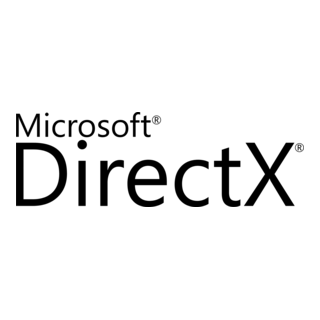
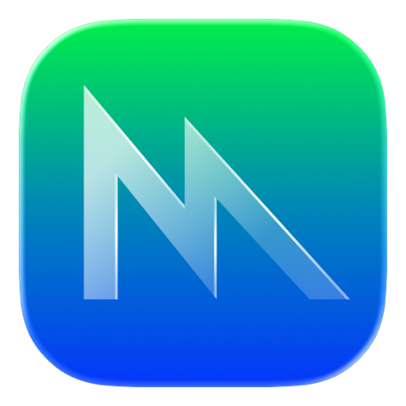
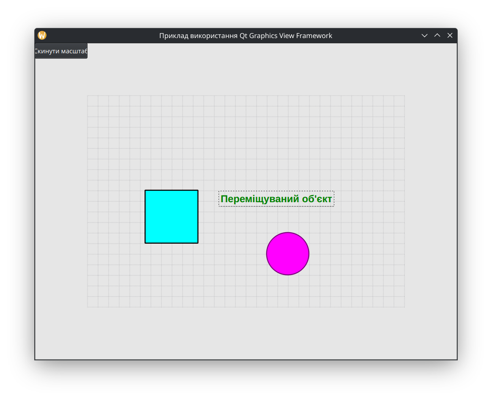

## Архітектура та застосування Qt Graphics View Framework (Розширена версія)

Перш ніж вивчати Qt Graphics View Framework, важливо розуміти за допомогою яких API він реалізує рендеринг графіки. Qt підтримує різні графічні API, такі як OpenGL, DirectX та Vulkan, що дозволяє розробникам створювати високопродуктивні графічні застосунки. Цей фреймворк надає потужний інструментарій для роботи з двовимірною графікою, включаючи можливості для створення складних візуальних інтерфейсів, анімацій та інтерактивних елементів.


### 1. OpenGL (Open Graphics Library)


Розробник: Khronos Group (раніше — Silicon Graphics)  
Рівень абстракції: Високий  
Платформи: Windows, macOS, Linux, Android, iOS та інші.  
Історія та концепція:  
OpenGL, випущений у 1992 році, є найстарішим та найбільш поширеним багатоплатформним стандартом для 2D/3D-графіки. Його ключова ідея — надати єдиний API, що працює на будь-якому обладнанні, від робочих станцій до мобільних телефонів (у вигляді OpenGL ES).  
Архітектурно OpenGL є **машиною станів (state machine)**. Розробник послідовно змінює різні глобальні стани (наприклад, встановлює поточний колір, активує текстуру, задає матрицю трансформації), після чого викликає команду на малювання. Драйвер відеокарти відстежує ці зміни і транслює їх у команди для GPU.  

**Переваги:**

- **Багатоплатформність:** Єдиний код може працювати на більшості операційних систем.  
- **Відносна простота:** Високорівневий підхід робить поріг входження нижчим порівняно з сучасними низькорівневими API.  
- **Величезна база знань:** Існує величезна кількість навчальних матеріалів, бібліотек та прикладів коду.

**Недоліки:**

- **Високі накладні витрати драйвера:** Постійне відстеження станів та перевірка помилок створює значне навантаження на центральний процесор (CPU), що стає "вузьким місцем" у складних сценах.  
- **Обмежена підтримка багатопотоковості:** Глобальний стан ускладнює ефективне розпаралелювання команд рендерингу на кількох ядрах CPU.  
- **Застаріла модель:** Архітектура OpenGL погано відповідає сучасним GPU, які є значно більш гнучкими та програмованими. Apple офіційно оголосила OpenGL застарілим (deprecated) на користь власного API Metal.

### 2. DirectX



Розробник: Microsoft  
Рівень абстракції: Високий (DirectX 9-11) / Низький (DirectX 12)  
Платформи: Windows, Xbox.  
Історія та концепція:  
DirectX — це набір мультимедійних API, створений Microsoft для розробки ігор та інших високопродуктивних застосунків на власних платформах. Його графічний компонент, Direct3D, є прямим конкурентом OpenGL.  
Протягом своєї історії Direct3D пройшов значну еволюцію:

- **Direct3D 9-11:** Працювали за моделлю, подібною до OpenGL, надаючи високорівневий доступ до GPU.  
- **Direct3D 12 (2015):** Став відповіддю Microsoft на потребу в низькорівневому доступі. Він надає розробникам значно більше контролю над апаратним забезпеченням, управлінням пам'яттю та синхронізацією, подібно до Vulkan.

**Переваги:**

- **Глибока інтеграція з Windows:** Забезпечує стабільну роботу та високу продуктивність на цільовій платформі.  
- **Потужні інструменти розробки:** Microsoft надає відмінні засоби для профілювання та зневадження (PIX).  
- **Широка підтримка в ігровій індустрії:** Є де-факто стандартом для розробки AAA-ігор під Windows.

**Недоліки:**

- **Платформна обмеженість:** Працює виключно на операційних системах та консолях від Microsoft.  
- **Складність (DirectX 12):** Як і інші низькорівневі API, вимагає від розробника значно більшої експертизи.

### 3. Vulkan


Розробник: Khronos Group  
Рівень абстракції: Низький  
Платформи: Windows, Linux, Android, (macOS/iOS через прошарки, як-от MoltenVK).  
Історія та концепція:  
Vulkan, випущений у 2016 році, є сучасним багатоплатформним API та ідейним наступником OpenGL. Його головна мета — надати прямий, низькорівневий доступ до GPU, мінімізуючи накладні витрати драйвера.  
На відміну від OpenGL, Vulkan не є машиною станів. Розробник повинен **явно** керувати всіма аспектами рендерингу:

- **Командні буфери (Command Buffers):** Замість миттєвого виконання, команди записуються в буфери, які потім можна відправляти на виконання на GPU.  
- **Управління пам'яттю:** Розробник сам відповідає за виділення та звільнення пам'яті на GPU.  
- **Синхронізація:** Явне управління синхронізацією між CPU та GPU за допомогою семафорів та бар'єрів.

**Переваги:**

- **Максимальна продуктивність:** Мінімальні накладні витрати драйвера дозволяють повністю завантажити GPU.  
- **Ефективна багатопотоковість:** Дозволяє записувати командні буфери паралельно на кількох ядрах CPU.  
- **Багатоплатформність:** Працює на більшості сучасних платформ.

**Недоліки:**

- **Надзвичайна складність:** Поріг входження є дуже високим. Код на Vulkan є значно більш багатослівним та складним порівняно з OpenGL.  
- **Відповідальність на розробнику:** Всі завдання з валідації, синхронізації та управління пам'яттю лягають на плечі програміста.

### 4. Metal



Розробник: Apple  
Рівень абстракції: Низький  
Платформи: macOS, iOS, iPadOS, tvOS.  
Історія та концепція:  
Metal був представлений Apple у 2014 році як заміна застарілому OpenGL на своїх платформах. Це низькорівневий API, що за своєю філософією близький до DirectX 12 та Vulkan, але розроблений з урахуванням специфіки апаратного забезпечення Apple.  
Metal надає розробникам прямий доступ до GPU, мінімізуючи накладні витрати, та глибоко інтегрований з іншими технологіями екосистеми Apple, такими як мова Swift та фреймворки для машинного навчання.  
**Переваги:**

- **Висока продуктивність:** Оптимізований для конкретного "заліза" (процесори Apple Silicon, GPU від Apple та партнерів).  
- **Глибока інтеграція в екосистему:** Відмінна взаємодія з іншими фреймворками Apple.  
- **Збалансована складність:** Вважається дещо простішим у вивченні, ніж Vulkan, завдяки більш продуманому дизайну API.

**Недоліки:**

- **Ексклюзивність:** Працює виключно на пристроях Apple, що робить його непридатним для багатоплатформної розробки.

### Порівняльна таблиця

| Характеристика | OpenGL | DirectX | Vulkan | Metal |
| :---- | :---- | :---- | :---- | :---- |
| **Розробник** | Khronos Group | Microsoft | Khronos Group | Apple |
| **Платформи** | Кросплатформний | Windows, Xbox | Кросплатформний | Платформи Apple |
| **Рівень абстракції** | Високий | Високий/Низький | Низький | Низький |
| **Основна перевага** | Простота, кросплатформність | Інтеграція з Windows | Максимальна продуктивність | Оптимізація під Apple |
| **Основний недолік** | Застаріла архітектура | Платформна залежність | Висока складність | Платформна залежність |
| **Керування пам'яттю** | Неявне (драйвер) | Неявне/Явне | Явне | Явне |
| **Багатопотоковість** | Обмежена | Повна (DX12) | Повна | Повна |


Починаючи з Qt 6, було впроваджено новий шар абстракції **RHI (Rendering Hardware Interface)**, який дозволяє коду Qt працювати поверх різних графічних API (Vulkan, DirectX, Metal для платформ Apple, OpenGL) без змін у коді застосунку. Це означає, що ваш застосунок, що використовує Graphics View, може автоматично отримати переваги від сучасних API, якщо вони доступні на цільовій платформі.

## Qt Graphics View Framework

**Qt Graphics View Framework** — фундаментальний компонент бібліотеки Qt, призначеного для розробки складних, інтерактивних двовимірних графічних інтерфейсів. Цей фреймворк надає високорівневу архітектуру для управління та візуалізації великої кількості графічних елементів (items), що розташовані у віртуальному просторі, іменованому сценою (scene), та відображаються за допомогою одного або декількох віджетів-переглядачів (view).  
Застосування Graphics View є доцільним при створенні широкого спектра програмних продуктів, таких як редактори діаграм, системи моніторингу, інтерфейси для автоматизованого проектування (САПР), інтерактивні картографічні системи, інструменти для візуалізації даних та двовимірні ігри. Фреймворк інкапсулює складні аспекти рендерингу, геометричних трансформацій, визначення зіткнень, обробки подій та оптимізації продуктивності, що дозволяє розробнику зосередитися на реалізації основної бізнес-логіки застосунку. У цій розширеній лекції ми також розглянемо просунуті теми, такі як механізми оптимізації, анімації та вбудовування віджетів.

## Архітектура Graphics View Framework

В основі фреймворку лежить архітектурний патерн, аналогічний Model-View, проте спеціалізований для роботи з графічними об'єктами. Він забезпечує чітке розділення між даними (графічною моделлю) та їх візуальним представленням. Це розділення (decoupling) є ключовим для досягнення гнучкості та продуктивності. Архітектура складається з трьох основних компонентів:

1. **QGraphicsScene (Сцена)** — Клас, що функціонує як логічний контейнер для графічних елементів. Сцена являє собою абстрактний двовимірний простір, що управляє елементами, їх станами та геометричним розташуванням, а також забезпечує поширення подій. Вона є авторитетним джерелом стану графічної моделі і не залежить від способу її візуалізації.  
2. **QGraphicsView (Переглядач)** — Віджет, що забезпечує візуалізацію сцени. Переглядач виконує роль "камери", що спрямована на сцену, дозволяючи користувачеві здійснювати навігацію (прокрутку, масштабування) та взаємодіяти з елементами. Для однієї сцени може бути створено декілька переглядачів, які будуть синхронізовано відображати її вміст з різних ракурсів або з різним рівнем деталізації.  
3. **QGraphicsItem (Елемент)** — Абстрактний базовий клас для всіх об'єктів, що можуть бути розміщені на сцені. Це можуть бути як примітивні фігури (прямокутники, еліпси), так і складні композитні об'єкти з власною логікою поведінки та візуальним представленням.

### Аналогія: Театральна сцена

Для кращого розуміння даної архітектури доцільно провести аналогію з театральною постановкою:

- **QGraphicsScene** може бути зіставлена із самою сценою, що має визначені розміри, координати та декорації, і на якій відбуваються всі дії. Вона є "режисером-постановником", який знає, де знаходиться кожен актор та реквізит.  
- **QGraphicsItem** є аналогом акторів та реквізиту. Кожен такий об'єкт має власну позицію, форму, зовнішній вигляд та поведінку, визначену його "сценарієм", проте не залежить від ракурсу спостереження. Актор знає як грати свою роль, але не переймається тим, з якої камери його знімають.  
- **QGraphicsView** виконує роль глядача або телевізійної камери. Спостерігач може охоплювати поглядом усю сцену, або ж камера може фокусуватися на окремому об'єкті (масштабування) чи змінювати кут огляду (обертання).

Такий підхід забезпечує значну гнучкість, дозволяючи модифікувати елементи на сцені незалежно від їх візуального представлення, що є передумовою для створення складних, модульних інтерфейсів. Наприклад, можна розробити складний елемент діаграми (QGraphicsItem) один раз, а потім відображати його у звичайному вигляді в одному QGraphicsView і у вигляді спрощеної іконки — в іншому, не дублюючи логіку самого елемента.

## Детальний огляд ключових класів

### QGraphicsScene (Сцена)

Сцена є логічним ядром графічного інтерфейсу. Її основні функції включають:

- **Надання інтерфейсу для управління елементами:** Методи для додавання ('addItem()'), видалення ('removeItem()') та ефективного пошуку елементів.  
- **Ефективна індексація:** Сцена використовує алгоритм просторового розбиття **BSP (Binary Space Partitioning)**. Концептуально, весь простір сцени рекурсивно ділиться на дві частини. Кожна з цих частин далі ділиться на дві, і так далі, створюючи деревовидну структуру. Коли потрібно знайти елемент у певній точці, фреймворк швидко відкидає цілі гілки дерева, які не перетинаються з шуканою областю. Це забезпечує логарифмічну складність O(log n) для операцій пошуку замість лінійної O(n), що є критично важливим для інтерактивності при роботі з тисячами та мільйонами об'єктів.  
- **Управління шарами (Z-order):** Елементи на сцені малюються в певному порядку. Цим порядком можна керувати за допомогою методу `item->setZValue()`. Елементи з більшим Z-значенням малюються поверх елементів з меншим. За замовчуванням всі елементи мають Z-значення 0 і малюються в порядку додавання.  
- **Поширення подій:** Сцена отримує події від `QGraphicsView`, трансформує їх у свою систему координат і делегує відповідним елементам.  
- **Управління станами елементів:** Відстеження виділених елементів (`selectedItems()`) та елемента, що має фокус введення (`focusItem()`).  
- **Рендеринг фону та переднього плану:** Надання можливості для кастомного малювання фону (`drawBackground()`) та переднього плану (`drawForeground()`) сцени.

### QGraphicsView (Переглядач)

Переглядач є віджетом, що інтегрується у віконний інтерфейс застосунку.

- **Візуалізація:** Відповідає за рендеринг сцени. Для підвищення продуктивності можна використовувати рушій на базі OpenGL, встановивши `QOpenGLWidget` як область перегляду (`view->setViewport(new QOpenGLWidget())`).  
- **Трансформації:** Забезпечує можливість масштабування (`scale()`) та обертання (`rotate()`) видимої області сцени. Поведінкою масштабування можна керувати за допомогою `setTransformationAnchor()`. Наприклад, `QGraphicsView::AnchorUnderMouse` змусить вид масштабуватися відносно позиції курсора, створюючи інтуїтивний ефект "наближення".  
- **Перетворення координат:** Здійснює перетворення координат між системами віджета (пікселі), сцени та елементів.  
- **Оптимізація оновлень:** QGraphicsView підтримує кілька режимів оновлення області перегляду (`setViewportUpdateMode()`):  
  - `FullViewportUpdate`: Найпростіший, але найменш ефективний режим. Увесь екран перемальовується при будь-якій зміні.  
  - `MinimalViewportUpdate`: Фреймворк намагається перемалювати лише ті прямокутні області, які були змінені.  
  - `SmartViewportUpdate` (за замовчуванням): Найбільш інтелектуальний режим, який аналізує вміст і намагається знайти оптимальний спосіб оновлення, мінімізуючи обсяг перемальовування.  
- **Режими навігації:** Має вбудовані режими, такі як `ScrollHandDrag` (перетягування сцени) та `RubberBandDrag` (виділення елементів рамкою).

#### **QGraphicsItem (Елемент)**

Це базовий клас для всіх графічних об'єктів. Для створення кастомних елементів необхідно успадкувати клас від QGraphicsItem та реалізувати два ключові віртуальні методи:

1. `boundingRect()`: Повертає QRectF, що описує обмежувальний прямокутник елемента. Цей метод має бути реалізований максимально ефективно, оскільки він викликається дуже часто. Неточний boundingRect може призвести до візуальних артефактів (якщо він занадто малий) або до зниження продуктивності (якщо він занадто великий).  
2. `paint(QPainter *painter, const QStyleOptionGraphicsItem *option, QWidget *widget)`: Реалізує логіку малювання.  
   * `painter`: Інструмент для малювання.  
   * `option`: Надає інформацію про стан елемента (наприклад, чи він виділений (`option->state & QStyle::State_Selected`), чи має фокус). Це дозволяє змінювати вигляд елемента залежно від його стану.  
   * `widget`: Вказує на віджет, на якому відбувається малювання (зазвичай, QGraphicsView).

Додатково можуть бути реалізовані методи для оптимізації:

* `shape()`: Повертає точну форму елемента (QPainterPath). Це дозволяє фреймворку точніше визначати зіткнення та області для перемальовування, що особливо важливо для непрямокутних або увігнутих фігур.  
* `opaqueArea()`: Повертає шлях, що описує повністю непрозору частину елемента. Фреймворк може використовувати цю інформацію, щоб не малювати елементи, які знаходяться повністю за цією областю.

## Система координат

Розуміння системи координат є фундаментальною вимогою для роботи з Graphics View. Фреймворк оперує трьома взаємопов'язаними системами координат:

1. **Координати Елемента (Item Coordinates):** Локальна система координат кожного елемента, зазвичай з центром у точці (0, 0). Усі операції малювання в методі paint() виконуються в цій системі.  
2. **Координати Сцени (Scene Coordinates):** Глобальна система координат, єдина для всіх елементів на сцені. Позиція елемента на сцені визначається через метод setPos(x, y).  
3. **Координати Переглядача (View Coordinates):** Фізичні координати віджета QGraphicsView в пікселях. (0,0) відповідає верхньому лівому куту віджета.

Для перетворення між цими системами надається набір функцій, таких як `QGraphicsView::mapToScene()`, `QGraphicsItem::mapToScene()` та інші.

## Ключові можливості та взаємодія

#### Масштабування та Обертання

Трансформації видимої області сцени виконуються за допомогою методів QGraphicsView:  
// Застосувати двократне збільшення  
`view->scale(2, 2);`

// Повернути видиму область на 90 градусів за годинниковою стрілкою  
`view->rotate(90);`

Слід зазначити, що ці операції модифікують лише матрицю трансформації переглядача, не впливаючи на координати та розміри самих елементів на сцені.

#### Взаємодія з Елементами

Для надання елементам інтерактивності використовуються прапори, що встановлюються методом setFlag():

* `QGraphicsItem::ItemIsMovable`: Надає можливість переміщення елемента.  
* `QGraphicsItem::ItemIsSelectable`: Надає можливість виділення елемента.  
* `QGraphicsItem::ItemIsFocusable`: Надає можливість отримання фокусу введення.

Для реалізації більш складної логіки взаємодії слід перевизначати віртуальні методи обробки подій у класі елемента, такі як mousePressEvent(), hoverEnterEvent(), keyPressEvent() тощо.

#### Групування та Ієрархія

Елементи можуть бути об'єднані в групу за допомогою класу QGraphicsItemGroup. Група сама є об'єктом QGraphicsItem, що дозволяє застосовувати трансформації до всіх її членів як до єдиного цілого. Крім того, можливе створення ієрархічних зв'язків (`item->setParentItem(parent)`), при яких дочірні елементи успадковують трансформації батьківського.

#### Анімації та вбудовані віджети

* **Анімації:** Qt Animation Framework легко інтегрується з Graphics View. Клас `QPropertyAnimation` може анімувати властивості `QGraphicsItem` (наприклад, pos, scale, rotation, opacity), створюючи плавні переходи та ефекти.  
* **Вбудовування віджетів:** Клас `QGraphicsProxyWidget` дозволяє розміщувати стандартні віджети (QPushButton, QLineEdit тощо) безпосередньо на сцені. Це відкриває можливості для створення складних інтерфейсів, де елементи управління є частиною графічної сцени.

## Практичний приклад

Для демонстрації вищезазначених концепцій розглянемо приклад створення простого застосунку.  
Буде створено проєкт Qt Widgets Application. Вміст файлу main.cpp слід замінити на наступний код:
```cpp
#include <QApplication>
#include <QGraphicsView>
#include <QGraphicsScene>
#include <QGraphicsRectItem>
#include <QGraphicsEllipseItem>
#include <QGraphicsTextItem>
#include <QGraphicsItemGroup>
#include <QBrush>
#include <QPen>
#include <QFont>
#include <QGraphicsProxyWidget>
#include <QPushButton>

int main(int argc, char *argv[])
{
    QApplication a(argc, argv);

    // 1\. Ініціалізація сцени
    QGraphicsScene scene;
    scene.setSceneRect(-300, -200, 600, 400);
    scene.setBackgroundBrush(QBrush(QColor(230, 230, 230)));  
      
    // Рендеринг координатної сітки на фоні  
    QPen gridPen(Qt::gray);
    gridPen.setStyle(Qt::DotLine);
    for (int x = -300; x <= 300; x += 20) {
        scene.addLine(x, -200, x, 200, gridPen);
    }
    for (int y = -200; y <= 200; y += 20) {
        scene.addLine(-300, y, 300, y, gridPen);
    }

    // 2\. Створення графічних елементів
    QGraphicsRectItem *rect = new QGraphicsRectItem(0, 0, 100, 100);
    rect->setPos(-180, -130);
    rect->setBrush(QBrush(Qt::cyan));
    rect->setPen(QPen(Qt::black, 2));

    QGraphicsEllipseItem *ellipse = new QGraphicsEllipseItem(0, 0, 80, 80);
    ellipse->setPos(50, -50);
    ellipse->setBrush(QBrush(Qt::magenta));
    ellipse->setPen(QPen(Qt::darkMagenta, 2));

    QGraphicsTextItem *text = new QGraphicsTextItem("Переміщуваний об'єкт");
    text->setPos(-70, 50);
    text->setDefaultTextColor(Qt::darkGreen);
    QFont font("Arial", 14, QFont::Bold);
    text->setFont(font);

    // 3\. Конфігурація інтерактивності елемента
    text->setFlag(QGraphicsItem::ItemIsMovable);
    text->setFlag(QGraphicsItem::ItemIsSelectable);
    text->setFlag(QGraphicsItem::ItemIsFocusable);

    // 4\. Створення групи елементів
    QGraphicsItemGroup *group = new QGraphicsItemGroup();
    group->addToGroup(rect);
    group->addToGroup(ellipse);
    group-\>setFlag(QGraphicsItem::ItemIsMovable);

    // 5\. Додавання віджета на сцену за допомогою проксі
    QPushButton *button = new QPushButton("Скинути масштаб");
    QGraphicsProxyWidget *proxy = scene.addWidget(button);
    proxy->setPos(150, 150);

    // 6\. Додавання елементів на сцену  
    scene.addItem(group);  
    scene.addItem(text);

    // 7\. Ініціалізація та конфігурація переглядача  
    QGraphicsView view(\&scene);  
    view.setWindowTitle("Приклад використання Qt Graphics View Framework");  
    view.setRenderHint(QPainter::Antialiasing);
    view.setDragMode(QGraphicsView::RubberBandDrag);
    view.resize(800, 600);

    // Підключення сигналу кнопки до слота для скидання трансформації
    QObject::connect(button, &QPushButton::clicked, [&view]() {
        view.resetTransform();
    });

    view.show();

    return a.exec();  
}
```
 
Даний код ініціалізує сцену з координатною сіткою, створює інтерактивні графічні елементи та групує їх. Ключовим доповненням є використання QGraphicsProxyWidget для вбудовування стандартної кнопки QPushButton на сцену. Сигнал clicked цієї кнопки під'єднано до слота, який скидає всі трансформації (масштабування, обертання) переглядача до початкового стану за допомогою методу view.resetTransform(). Це демонструє потужну можливість поєднання традиційних віджетів та графічної сцени.





## Додаткові матеріали для вивчення:
- [The Graphics View Framework](https://doc.qt.io/qt-6/graphicsview.html) — вичерпний опис архітектури та класів.  
- [Qt Rendering Hardware Interface (RHI)](https://doc.qt.io/qt-6/qrhi.html) — інформація про новий шар абстракції над графічними API.  
