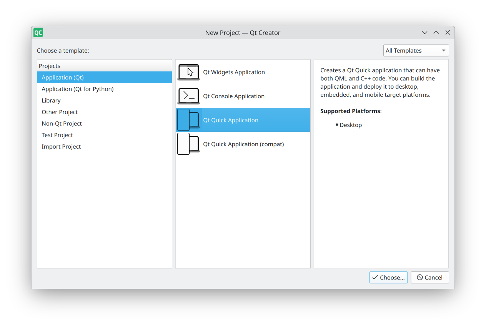
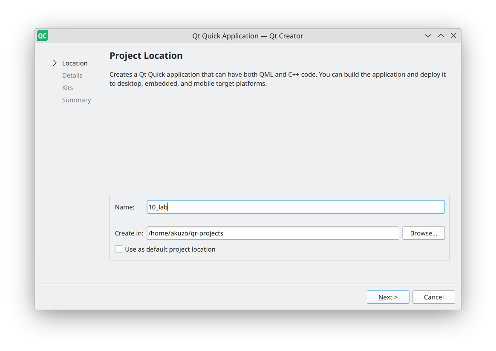
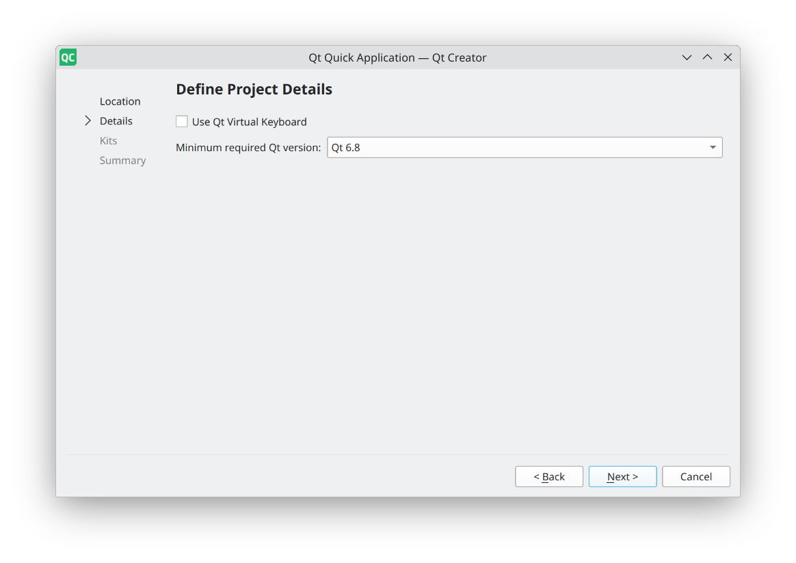
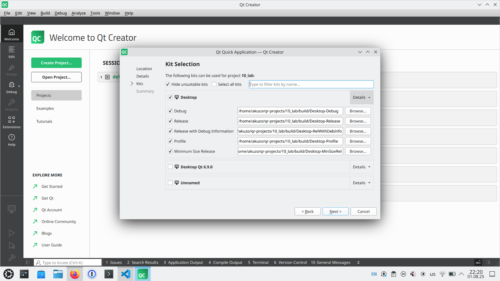
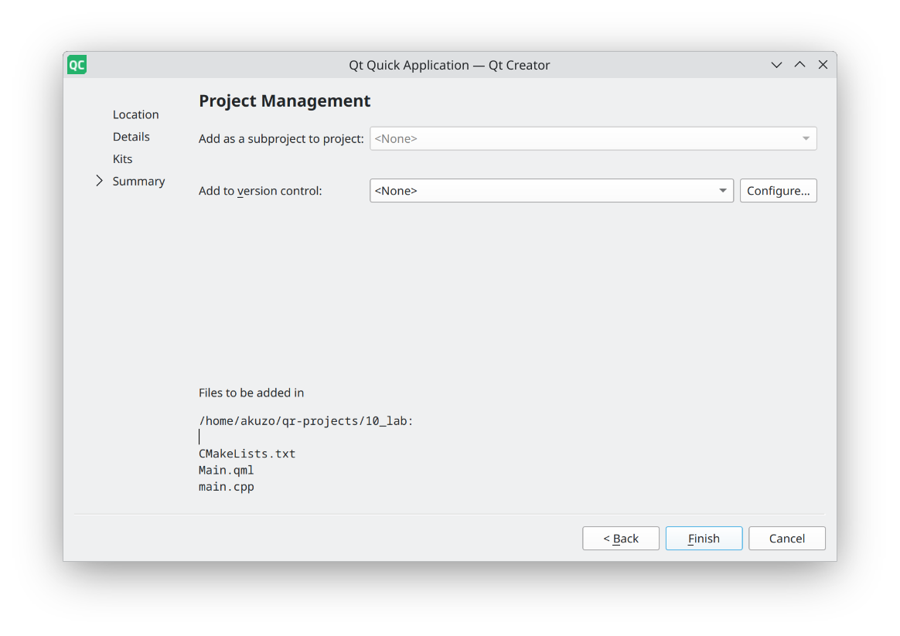
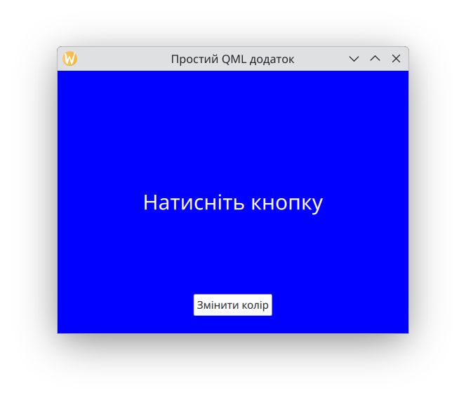

# Основи декларативного UI в Qt: QML

Протягом тривалого часу розробка графічних інтерфейсів (GUI) у таких фреймворках, як Qt, базувалася переважно на **імперативному підході**. У цьому підході ви створюєте віджети (наприклад, кнопки, поля введення) як об'єкти C++ і вручну, крок за кроком, маніпулюєте їхніми властивостями та розташуванням. Такий підхід є дуже потужним, але може бути складним та багатослівним, особливо для анімацій та складних динамічних інтерфейсів.  
На противагу цьому, **декларативний підхід** дозволяє описувати, "що" має бути в інтерфейсі, замість того, щоб вказувати, "як" його створювати. Ви описуєте візуальний стан, а фреймворк бере на себе відповідальність за його реалізацію. У Qt декларативний підхід представлений мовою **QML (Qt Modeling Language)**, яка стала стандартом для створення сучасних, динамічних та кросплатформних інтерфейсів.  
QML — це мова, оптимізована для опису інтерфейсів користувача, яка поєднує в собі простоту декларативного синтаксису з потужністю JavaScript для логіки. Це ідеальне рішення для швидкої розробки анімацій, ефектів, мобільних додатків та додатків для вбудованих систем.  
У цій лекції ми розглянемо основи QML: його синтаксис, ключові концепції та основні елементи.

### **QML проти Qt Widgets: Декларативний vs Імперативний підхід**

Щоб краще зрозуміти переваги QML, давайте детальніше порівняємо його з традиційним підходом на віджетах (Qt Widgets).

| Характеристика | Qt Widgets (Імперативний) | Qt Quick/QML (Декларативний) |
| :---- | :---- | :---- |
| **Опис інтерфейсу** | **Імперативний** (C++ код або XML-файл .ui). Розробник крок за кроком вказує, як створити, розмістити та налаштувати кожен віджет. Це схоже на написання детальної інструкції для збирання меблів. | **Декларативний** (QML-файл). Розробник описує бажаний кінцевий стан UI у вигляді ієрархії об'єктів. Це схоже на надання креслення, а не інструкції. |
| **Зв'язок з даними** | Здійснюється через сигнали/слоти та Model-View Framework (наприклад, QTableView з QStandardItemModel). Це потужна, але структурована система, що вимагає більше коду. | **Прив'язка властивостей (Property Bindings)**. Пряме зв'язування властивостей (наприклад, myRectangle.color \= myButton.color). Система автоматично відстежує залежності та оновлює значення, що значно зменшує кількість boilerplate-коду. |
| **Логіка** | **C++**. Вся логіка (обробка подій, бізнес-правила) написана на C++. Це забезпечує високу продуктивність, доступ до низькорівневих API та повний контроль. | **JavaScript** для логіки UI, **C++** для складної бізнес-логіки та моделей даних. Використання JavaScript дозволяє швидко писати просту логіку та прототипувати, не перекомпілюючи весь додаток. |
| **Компонування** | **Менеджери розташування** (QHBoxLayout, QVBoxLayout, QGridLayout). Це потужна, але багатослівна система, де кожен віджет повинен бути явно доданий у макет. | **Система якорів** (anchors). Простіший, більш інтуїтивний та гнучкий підхід. Ви прив'язуєте один елемент до іншого або до його батька, і QML автоматично обчислює їхнє розташування при зміні розмірів. |
| **Анімації та динаміка** | Реалізуються вручну, часто з використанням QPropertyAnimation або QTimer. Складно та багатослівно. Наприклад, для переміщення віджета потрібно створити об'єкт анімації, встановити властивість, тривалість, початкове та кінцеве значення, а потім запустити. | **Вбудовані анімації та переходи**. Легко описуються в QML, часто всього в декількох рядках. Плавна анімація — це стандартна поведінка. Animation та Transition дозволяють легко описувати складні послідовності рухів. |
| **Сфери застосування** | Десктопні додатки, бізнес-програми, додатки з високою продуктивністю, складним UI та інтенсивною обробкою даних. | Мобільні додатки, вбудовані системи, кросплатформні додатки з динамічним UI, де швидкість розробки та привабливий дизайн є пріоритетом. |

**QML — це не заміна Qt Widgets, а альтернатива**. Вибір між ними залежить від вимог проекту. QML ідеально підходить, якщо ви зосереджені на динаміці, анімаціях та швидкій розробці UI.

## Що таке QML?

**QML** — це декларативна мова, подібна до JSON, що використовується для опису об'єктів та їхніх властивостей. Вона є частиною фреймворку **Qt Quick**, який включає в себе графічний рушій, анімації та поведінку.  
Основна ідея QML полягає в тому, що інтерфейс складається з ієрархії об'єктів. Ви описуєте ці об'єкти, їхні властивості та взаємозв'язки, а Qt автоматично створює та управляє ними.

### Ключові особливості QML:

- **Декларативний синтаксис**: Легко читається та розуміється, оскільки описує UI у вигляді дерева об'єктів.  
- **Динамічність та анімації**: QML має вбудовані засоби для плавних анімацій, переходів та динамічної поведінки.  
- **Інтеграція з JavaScript**: Для реалізації логіки, обробки подій та обчислень використовується JavaScript.  
- **Інтеграція з C++**: QML може безшовно взаємодіяти з C++ кодом, дозволяючи використовувати потужну бізнес-логіку та моделі даних, написані на C++.

## Основи синтаксису QML

Файл QML (.qml) описує ієрархію компонентів. Кожен компонент є об'єктом, що має властивості.

### 1. Елементи (об'єкти)

Кожен компонент QML є екземпляром певного типу елемента. Типові елементи: Item (базовий невидимий елемент), Rectangle, Text, Image, MouseArea, Button тощо.
```qml
// MyFirstComponent.qml

import QtQuick

// Кореневий елемент компонента  
Rectangle {  
    // Властивості елемента  
    width: 200  
    height: 150  
    color: "lightblue"  
}
```

Тут ми оголосили компонент Rectangle з шириною 200, висотою 150 та кольором lightblue.

### 2. Властивості (Properties)

Властивості визначають стан об'єкта. Вони можуть бути простими типами (string, int, bool, color) або складними об'єктами.

- **Прив'язка властивостей (Property Bindings)**: Це одна з найпотужніших можливостей QML. Ви можете зв'язати властивість одного об'єкта зі значенням властивості іншого, і QML автоматично оновлюватиме її при зміні вихідного значення.

```qml
// Розмір круга залежить від ширини вікна  
Rectangle {  
    id: container  
    width: 400  
    height: 400  
    color: "white"

    Rectangle {  
        id: mySquare  
        width: 100  
        height: 100  
        color: "red"  
        // Ширина і висота квадрата завжди будуть дорівнювати половині розміру контейнера  
        width: container.width / 2  
        height: container.height / 2  
    }  
}
```
### 3. Ідентифікатори (id)

Використовується для присвоєння унікального імені елементу, щоб на нього можна було посилатися з інших частин коду. id може бути присвоєний лише одному елементу в компоненті.  
```qml
Rectangle {  
    id: myRectangle  
    width: 100  
    height: 50  
    color: "green"  
}
```
### 4. Сигнали та обробники подій

QML надає спеціальні обробники для подій. Вони починаються з on і імені сигналу. Наприклад, MouseArea має обробник onClicked.

```qml 
Rectangle {  
    width: 200  
    height: 200  
    color: "white"

    Text {  
        id: infoText  
        text: "Натисніть на мене"  
        anchors.centerIn: parent  
    }

    MouseArea {  
        anchors.fill: parent // Займає всю область батьківського елемента  
        onClicked: {  
            infoText.text \= "Клікнуто\!" // Оновлюємо текст при кліку  
            parent.color \= "lightgreen"  // Змінюємо колір батьківського елемента  
        }  
    }  
}
```

### 5. Розташування елементів (Anchors)

Замість складних менеджерів розташування, як у Qt Widgets, QML використовує систему "якорів" (anchors), що дозволяє прив'язувати один елемент до іншого або до його батьківського елемента.

- anchors.top: Прив'язка верхньої межі.  
- anchors.bottom: Прив'язка нижньої межі.  
- anchors.left: Прив'язка лівої межі.  
- anchors.right: Прив'язка правої межі.  
- anchors.centerIn: Центрування в межах іншого елемента.  
- anchors.fill: Займає всю область іншого елемента.

```qml
Rectangle {  
    width: 400  
    height: 400  
    color: "lightgray"

    Rectangle {  
        id: header  
        width: parent.width // Ширина дорівнює ширині батьківського елемента  
        height: 50  
        color: "darkgray"  
        anchors.top: parent.top // Прив'язка до верхньої межі батька  
    }

    Rectangle {  
        id: content  
        width: parent.width  
        color: "white"  
        anchors.top: header.bottom // Прив'язка до нижньої межі header  
        anchors.bottom: parent.bottom // Прив'язка до нижньої межі батька  
    }  
}
```

### 6. Компоненти та імпорти

QML дозволяє створювати власні компоненти у вигляді окремих файлів .qml, які потім можна імпортувати та використовувати.
```qml
// MyButton.qml (Власний компонент)  
import QtQuick

Rectangle {  
    id: button  
    width: 120  
    height: 40  
    color: "skyblue"  
    radius: 5

    Text {  
        id: buttonText  
        text: "Кнопка"  
        color: "white"  
        font.pointSize: 14  
        anchors.centerIn: parent  
    }

    MouseArea {  
        anchors.fill: parent  
        onClicked: console.log("Кнопку натиснуто\!")  
    }  
}
```

Щоб використати MyButton.qml в іншій програмі, достатньо його імпортувати.

## Створення першого Qt Quick проекту

Давайте розглянемо покроковий процес створення простого проекту на QML у Qt Creator.

1. **Запуск Qt Creator**:  
   - Відкрийте Qt Creator.  
2. **Створення нового проекту**:  
   - Виберіть File -> New File or Project....
   - У діалоговому вікні виберіть Application -> Qt Quick Application. Натисніть Choose....
   
3. **Налаштування проекту**:  
   - **Name**: Введіть назву проекту, наприклад, MyFirstQmlApp.  
   - **Create in**: Виберіть каталог, де буде збережено проект.
   
   - **Build System**: Мінімальну версію фреймворку Qt 6.x.x.  
    
4. **Вибір Kit**:  
   - Виберіть набір інструментів (Kit) для збірки (наприклад, Desktop Qt 6.x.x). Натисніть Next.  
   
5. **Вибір системи контролю версій**:  
   - Якщо ви використовуєте систему контролю версій (наприклад, Git), виберіть її. Якщо ні, залиште за замовчуванням. Натисніть Next.  
   

6. **Структура проекту**:  
   - Qt Creator створить проект з наступними основними файлами:  
     - **CMakeLists.txt**: Файл конфігурації для збірки.  
     - **main.cpp**: Головний файл програми на C++, який завантажує ваш QML-файл.  
     - **main.qml**: Головний файл QML, де ви описуєте інтерфейс користувача.  
7. **Файл main.cpp (зверніть увагу)**:  
   - Цей файл створює об'єкт `QGuiApplication`, а потім `QQmlApplicationEngine`.  
   - `engine.load(url);` - це ключовий рядок, який завантажує ваш main.qml файл.  
   - Цей C++ код залишається майже незмінним, оскільки вся логіка UI знаходиться в QML.  
8. **Редагування main.qml**:  
   - Відкрийте файл main.qml. Qt Creator надає вбудований редактор з підсвічуванням синтаксису та автодоповненням.  
   - Ви також можете переключитися в режим **"Design"** (у верхньому лівому куті), щоб візуально редагувати інтерфейс (хоча багато розробників віддають перевагу ручному редагуванню коду через його гнучкість).  
9. **Збірка та запуск**:  
   - Натисніть зелену кнопку Run у Qt Creator.  
   - CMake збере ваш проект, а програма запустить вікно, яке відображатиме ваш інтерфейс, описаний у main.qml.

Цей процес демонструє, як швидко можна розпочати роботу з декларативним UI на QML, зосередившись на візуальній частині, а не на низькорівневих деталях C++.

## Мінімальний приклад програми на QML

```qml
// main.qml
import QtQuick
import QtQuick.Controls

// Головний елемент, що представляє вікно програми
ApplicationWindow {
    id: rootWindow
    title: "Простий QML додаток"
    width: 400
    height: 300
    visible: true

    // Властивість, яка буде змінюватися
    property color myColor: "gold"

    // Основний контейнер
    Rectangle {
        id: mainRect
        color: rootWindow.myColor // Прив'язка до властивості вікна
        width: parent.width
        height: parent.height

        // Текст по центру
        Text {
            id: myText
            text: "Натисніть кнопку"
            anchors.centerIn: parent
            font.pointSize: 18
            color: "white"
        }

        // Кнопка, що змінює колір
        Button {
            id: myButton
            text: "Змінити колір"
            anchors.horizontalCenter: parent.horizontalCenter
            anchors.bottom: parent.bottom
            anchors.bottomMargin: 20

            onClicked: {
                console.log("clicked", rootWindow.myColor);
                // Логіка на JavaScript для зміни кольору

                if (Qt.colorEqual(rootWindow.myColor, "gold")) {
                    rootWindow.myColor = "blue";
                } else {
                    rootWindow.myColor = "gold";
                }
            }
        }
    }
}
```



## Висновок

QML пропонує сучасний та ефективний спосіб розробки графічних інтерфейсів, що ґрунтується на декларативному підході. Завдяки простому синтаксису, потужній системі прив'язки властивостей та безшовній інтеграції з JavaScript, він дозволяє швидко створювати динамічні та анімовані інтерфейси, особливо для мобільних пристроїв та вбудованих систем.  
На відміну від імперативного підходу, який вимагає детального опису кожного кроку, QML дозволяє вам зосередитися на візуальному дизайні та структурі, роблячи код більш читабельним та легким для підтримки. Освоєння основ QML відкриває нові можливості для створення привабливих та сучасних додатків на кросплатформенному фреймворку Qt.

### **Додаткові матеріали для вивчення:**

* [Офіційна документація Qt 6: QML Basics](https://doc.qt.io/qt-6/qtqml-index.html)  
* [Офіційна документація Qt 6: Qt Quick Controls](https://doc.qt.io/qt-6/qtquick-index.html)  
